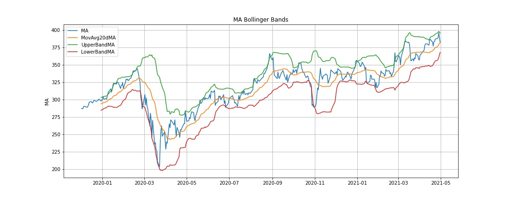
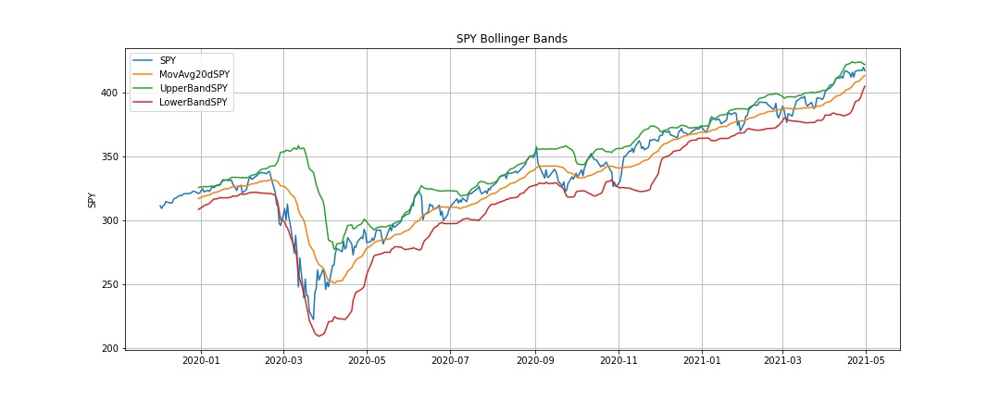
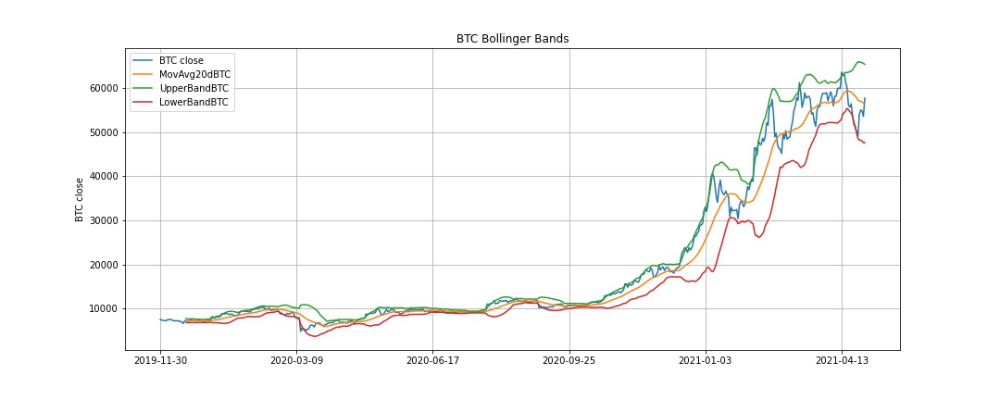
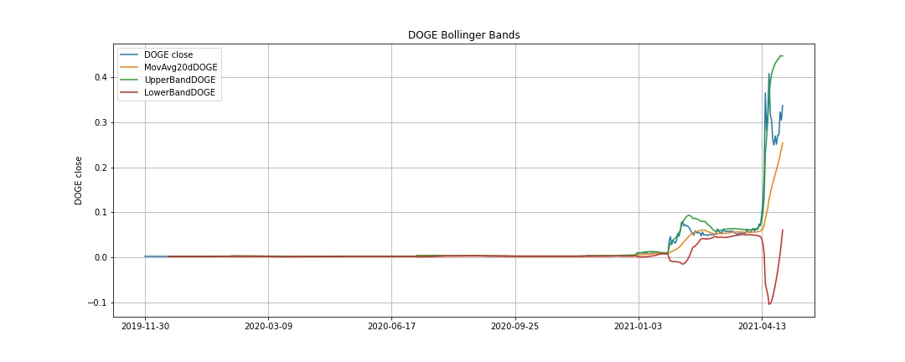
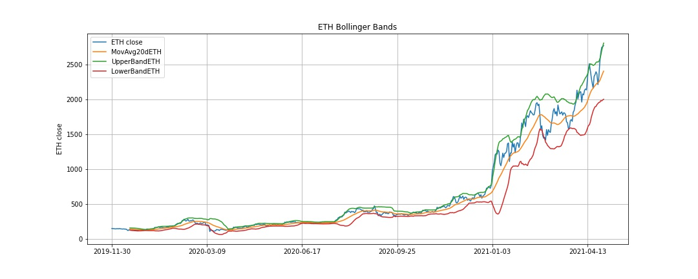
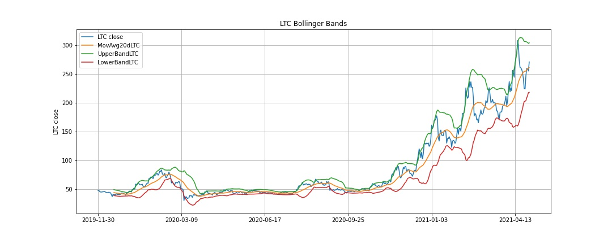

# **Bollinger Bands**

## *What is Bollinger Bands?*
A Bollinger Band is a technical analysis tool defined by a set of trendlines plotted two standard deviations (positively and negatively) away from a Simple Moving Average of a security's price, but which can be adjusted to user preferences.
### Three lines compose Bollinger Bands:
- Middle Band: 20 Days Simple Moving Average
- Upper Band: Simple Moving Average + 2 x 20 Days Rolling Standard Deviation
- Lower Band: Simple Moving Average - 2 x 20 Days Rolling Standard Deviation

They developed and copyrighted by technical trader John Bollinger, with the goal to discover opportunities that give investors a higher probability of properly identifying when an asset is oversold or overbought.

Bollinger Bands are used for trading strategies: When the security's price is in an ascending trend and it touches the middle or the upper band, it might be a good indicator to short the stock since a correction is likely to happen, while when the price is in a descending trend and touches the lower band or the middle band it might be a good signal to buy it. 

*Key assumption:* Asset prices disperse around the SMA following a normal distribution. As a result, 95% of prices will fall between 2 standard deviations of the SMA. 
*Key idea:* The volatility of the price of an asset is not constant. As a result, there exists fluctuations in the spread between the upper and lower Bollinger Bands. More specifically, if the volatility of an asset price falls, then the spread between the bands will contract. Conversely, if the volatility of an asset price increases, the spread between the bands expand. This will have important implications for trading strategies based on the analysis of Bollinger Bands

## *What does it have to do with our project?*
### The questions we are trying to answer: 
1. How well does the Bollinger Bands work in different asset type?
2. What are the characteristics for the asset type that work well and vice versa?

---

## Data Processing
We were able to utilize the Alpaca API to pull data from single name stock and ETFs for the duration (1.5 year). 

`etfs = alpaca.get_barset(tickers, timeframe, start = start_date, end = end_date, limit = 1000).df`

However, the Alpaca API doesn't have the same infomration for crypto. Luckily, Alpha Vantage has API for pullig crypto prices. 

`btc_url = "https://www.alphavantage.co/query?function=DIGITAL_CURRENCY_DAILY&symbol=BTC&market=USD&apikey=" + api_key`

`btc_data = requests.get(btc_url).json()`

`btc_df = pd.DataFrame.from_dict(btc_data['Time Series (Digital Currency Daily)'], orient='index')`

`btc_df.dropna(inplace=True)
btc_df.rename(columns={
    '4a. close (USD)':'BTC close',
}, inplace=True)
btc_df = btc_df[['BTC close']]
btc_df.sort_index(inplace=True)`

Overall, data is accessible and clean. We did some basic data quality check such as checking for na or null. 

New Library - Cufflinks is an interactive visualization library that binds the power of plotly with the flexibility of pandas. 

---

## Analysis
### Single Name Stock - Microsoft, Netflix, MasterCard, Exxon, and Disney
 

### ETFs - iShares Core US Aggregate Bond, SPDR S&P 500, US Natural Gas Fund, Vanguard Real Estate Index Fund, iShares Investmet Grade Corporate Bond
 

### Crypto - Bitcoin, Dogecoin, Ethereum, Chainlink, IoT Chain
 

To our surprise, the Bollinger Bands actually work for cryptocurrencies as well as stock and EFTs despite the repuration of being irregular and irrational in the crypto world. Looking at the graphs crossing different asset type, the prices are inside the bands most of the time. 

One interesting observation is the movement during March 2020 (we all know what happened). Stocks and ETFs had distinct dips with various degree during that few months with UNG, which is Nautral Gas Fund. Supposely the pandemic didn't have much impact in natural gas. The other sector that didn't get impacted for as long is the crypto market. For example, DOGE didn't move much during that time while other dipped a little for a few days and they were back to BUA. 

## % of data that's out side the bands in each asset type
| Asset | % above Upper Band | % below Lower Band | Total % outside Bands |
| ----------- | ----------- | ----------- | ----------- |
| MSFT | 9.27% | 1.97% | 11.24% |
| NFLX | 7.87%t | 2.25% | 10.11% |
| MA | 5.34% | 2.81% | 8.15% |
| XOM | 5.90% | 5.62% | 11.52% |
| DIS | 3.93% | 4.78% | 8.71% |
| AGG | 4.21% | 5.34% | 9.55% |
| SPY | 4.78% | 2.81% | 7.58% |
| UNG | 1.97% | 7.02% | 8.99% |
| VNQ | 5.62% | 4.49% | 10.11% |
| LQD | 4.49% | 5.62% | 10.11% |
| BTC | 9.27% | 2.51% | 11.78 |
| DOGE | 11.00% | 2.70% | 13.71% |
| ETH | 10.81% | 1.35% | 12.16% |
| LINK | 11.00% | 3.67% | 14.67% |
| LTC | 11.58% | 1.93% | 13.51% |

Above table confirms that the Bollinger Bands work cross asset types. In general, the % of data point outside the bands is between 7.58% to 14.67%. Cryptcurrencies do have more points outsdie the bands than the others. Another interesting observation is that among the outside band data, there are more points above upper band than below lower band. That could  be interpreted as the investment appreciates in the **long run**. 

## Beta
According to Investopedia "[t]he beta calculation is used to help investors understand whether a stock moves in the same direction as the rest of the market. It also provides insights about how volatile–or how risky–a stock is relative to the rest of the market. **For beta to provide any useful insight, the market that is used as a benchmark should be related to the stock**. For example, calculating a bond ETF's beta using the S&P 500 as the benchmark would not provide much helpful insight for an investor because bonds and stocks are too dissimilar."

This confirms the small beta for crypto because it's less sensitive to S&P 500 than the other single name stock. In order to comupte the beta for crypto, perhaps the equivalent "S&P 500" should be developed. 

---

## Conclusion
We wanted to analyze the efficiency of the Bollinger Bands by testing them with different kind of assets. Our initial belief was that Bollinger Bands would have proved to be not effective with highly volatile assets - for example cryptocurrencies. We discovered that yes, when the bands are wider, it means that a market is more volatile (crypto assets); while narrower bands mean that a market is more stable.

*Pros:*
- Easier to comprehend.           
- Bollinger bands may be a good indicator of market volatility
- The bands can also help with identifying new trends and the end of trends         

*Cons:*
- Traders might not receive signals until the price movement is already underway.
- Need to be used in conjunction with other forms of technical analysis 
- Not reliable in certain market conditions
- They weight older price data the same as the most recent

---
## Presenters
Willy Feid, Alice Lin, Julian Lopez, and Fabio Reato 

