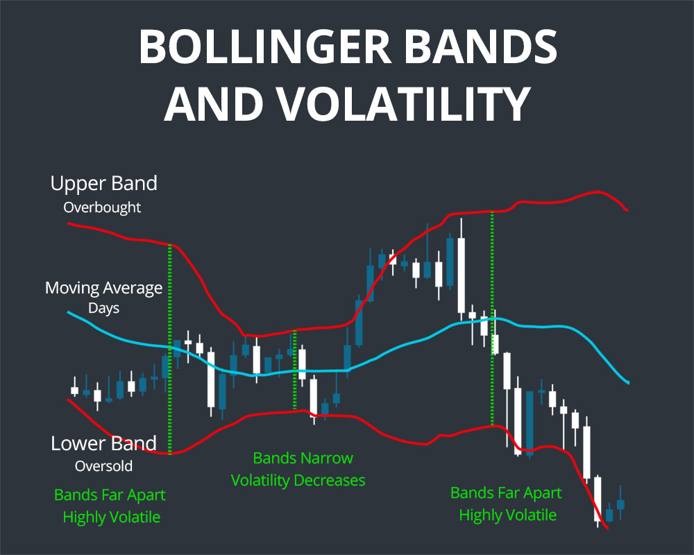
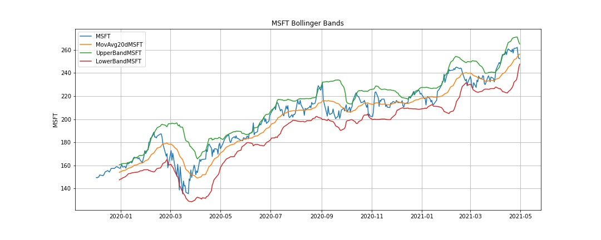
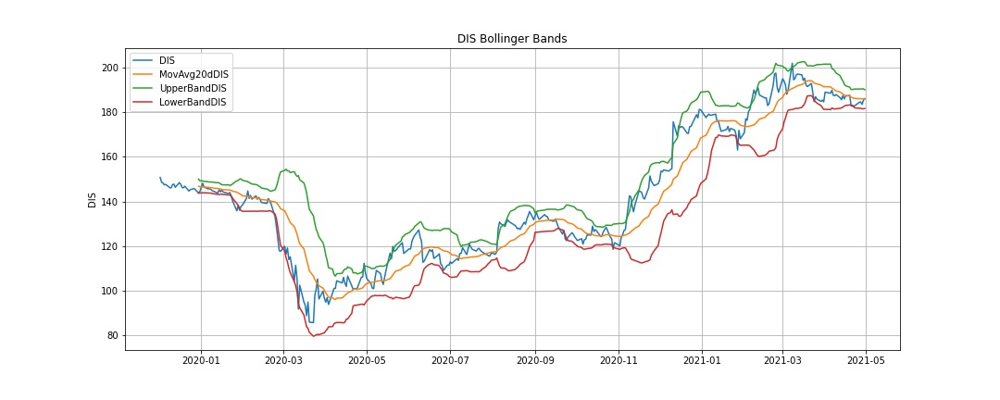
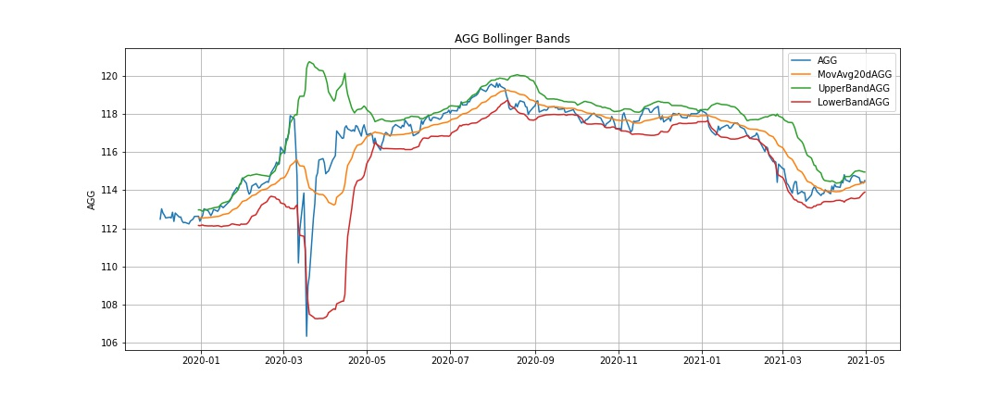
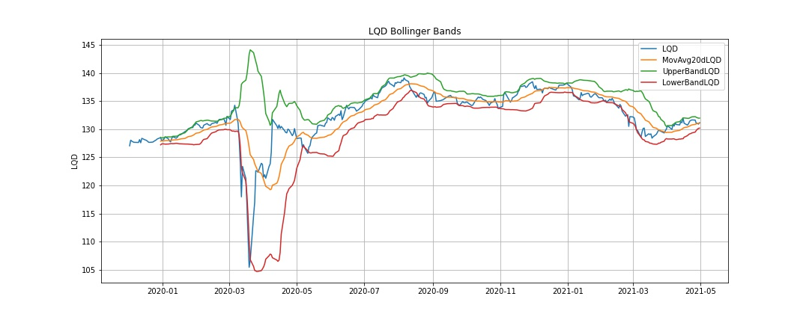

# **Bollinger Bands**

## *What is Bollinger Bands?*
A Bollinger Band is a technical analysis tool defined by a set of trendlines plotted two standard deviations (positively and negatively) away from a Simple Moving Average of a security's price, but which can be adjusted to user preferences.
### Three lines compose Bollinger Bands:
- Middle Band: 20 Days Simple Moving Average
- Upper Band: Simple Moving Average + 2 x 20 Days Rolling Standard Deviation
- Lower Band: Simple Moving Average - 2 x 20 Days Rolling Standard Deviation

They developed and copyrighted by technical trader John Bollinger, with the goal to discover opportunities that give investors a higher probability of properly identifying when an asset is oversold or overbought.

Bollinger Bands are used for trading strategies: When the security's price is in an ascending trend and it touches the middle or the upper band, it might be a good indicator to short the stock since a correction is likely to happen, while when the price is in a descending trend and touches the lower band or the middle band it might be a good signal to buy it. 

## *What does it have to do with our project?*
### The questions we are trying to answer: 
1. How well does the Bollinger Bands work in different asset type?
2. What are the characteristics for the asset type that work well and vice versa?

---

## Data Processing
We were able to utilize the Alpaca API to pull data from single name stock and ETFs for the duration (1.5 year). 

`etfs = alpaca.get_barset(tickers, timeframe, start = start_date, end = end_date, limit = 1000).df`

However, the Alpaca API doesn't have the same infomration for crypto. Luckily, Alpha Vantage has API for pullig crypto prices. 

`btc_url = "https://www.alphavantage.co/query?function=DIGITAL_CURRENCY_DAILY&symbol=BTC&market=USD&apikey=" + api_key`

`btc_data = requests.get(btc_url).json()`

`btc_df = pd.DataFrame.from_dict(btc_data['Time Series (Digital Currency Daily)'], orient='index')`

`btc_df.dropna(inplace=True)
btc_df.rename(columns={
    '4a. close (USD)':'BTC close',
}, inplace=True)
btc_df = btc_df[['BTC close']]
btc_df.sort_index(inplace=True)`

Overall, data is accessible and clean. We did some basic data quality check such as checking for na or null. 

---

## Analysis
### Single Name Stock - Microsoft, Netflix, MasterCard, Exxon, and Disney
 

### ETFs - iShares Core US Aggregate Bond, SPDR S&P 500, US Natural Gas Fund, Vanguard Real Estate Index Fund, iShares Investmet Grade Corporate Bond
 

### Crypto - Bitcoin, Dogecoin, Ethereum, Chainlink, IoT Chain
 

## Beta as mesaure of volitality
insert table

## % of data that's out side the bands in each asset type
insert table

## Correlation b/w beta and outside band %?
insert graph

---

## Conclusion
We wanted to analyze the efficiency of the Bollinger Bands by testing them with different kind of assets. Our initial belief was that Bollinger Bands would have proved to be not effective with highly volatile assets - for example cryptocurrencies. 

---
## Presenters
Willy Feid, Alice Lin, Julian Lopez, and Fabio Reato 

